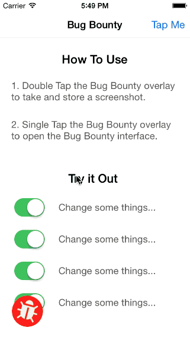

# Bug Hunt

A drop-in module that allows for easy bug reporting.

<p align="center">
<br />

<br />
</p>
## Usage

To show the Bug Hunt overlay:

```
[BugHunt showBugHunt];
```

#### EBHNetworkCommunicator

To handle network events, create a class that conforms to the `EBHNetworkCommunicator` protocol and give an instance to the BugHunt module:

```
MyNetworkCommunicator *networkCommunicator = [[MyNetworkCommunicator alloc] init];
[BugHunt setNetworkCommunicator:networkCommunicator];
```

Your network communicator is now responsible for responding to requests:

```
- (BOOL)createBugHuntIssue:(EBHBugReport *)bugReport
                  completion:(EBHCreateNewIssueCompletionBlock)completionBlock
{
    // Perform request asynchronously and call the completion block
    // when finished.

    // Let the caller know we are attempting to make the request so they
    // can display a loading indicator, etc if they would like.
    return YES;
}
```

## Installation

### CocoaPods (preferred)

This is currently a private pod so you will need to add the ________ podspec repo to your list if you haven't already.

Once that is done just add the following line to your podfile.

```
pod 'BugHunt', '~> 1.0'
```

### Manual Installation

1. Copy the `BugHunt` folder to your project.
2. Download and copy the [MRProgress](https://github.com/mrackwitz/MRProgress) source files to the project.

## Roadmap / Known Issues

* Option for reducing screenshot size before sending.
* Capture alert views.
* Add support for more than 3 pictures.
* Allow Bug Hunt to read in strings, parameters, etc from a config file.
* Add rotation support.

